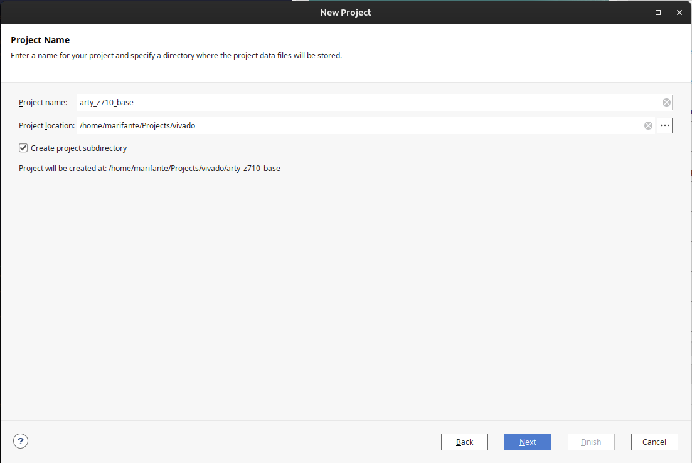
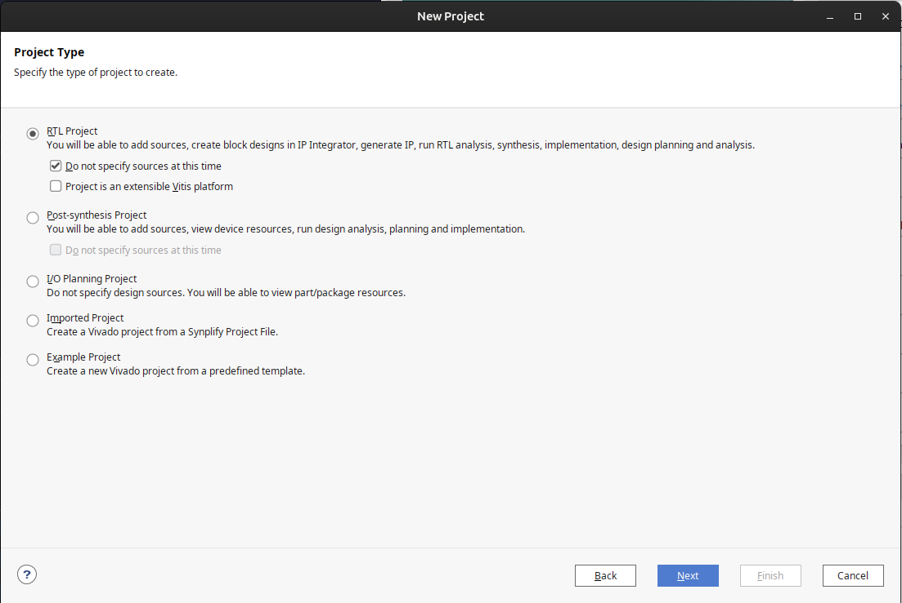
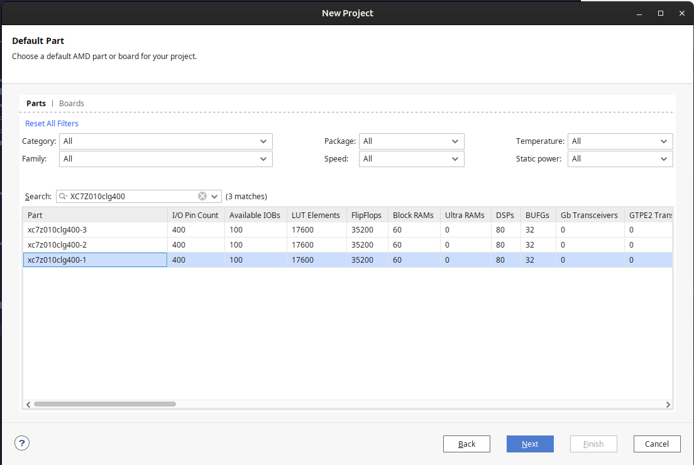

## Creating a XSA

In this brief guide, you will find how to create Xilinx .xsa file.

For more information on how to create a XSA, check "Creating an embedded project with zynq SoC - Example" reference.

### Create a new project in Vivado for your design.

1) Click "Create Project" in Vivado and choose it's name and location. Then click next.

2) In "Project Type" screen specify the type of source for your design. Most of the times it will be RTL. It is not needed to specify sources at this time (leave this checked). Uncheck the option that says "Project is an extensible Vitis platform".

3) In "Default part" screen, choose your SoC/board.
For example, if you are using the Arty Z710 development board, you can download from the catalog that part.

For example, if you select a SoC:

### Create a new Embedded Processor block diagram

This part is very well described in [Xilinx's guide](https://xilinx.github.io/Embedded-Design-Tutorials/docs/2021.1/build/html/docs/Introduction/Zynq7000-EDT/2-using-zynq.html#creating-an-embedded-processor-block-diagram). The minimal xsa described there can be found in ../xsa/minimal_system_wrapper.xsa.

## References

* [Creating an embedded project with zynq SoC - Example](https://xilinx.github.io/Embedded-Design-Tutorials/docs/2021.1/build/html/docs/Introduction/Zynq7000-EDT/2-using-zynq.html#example-1-creating-a-new-embedded-project-with-zynq-soc)
